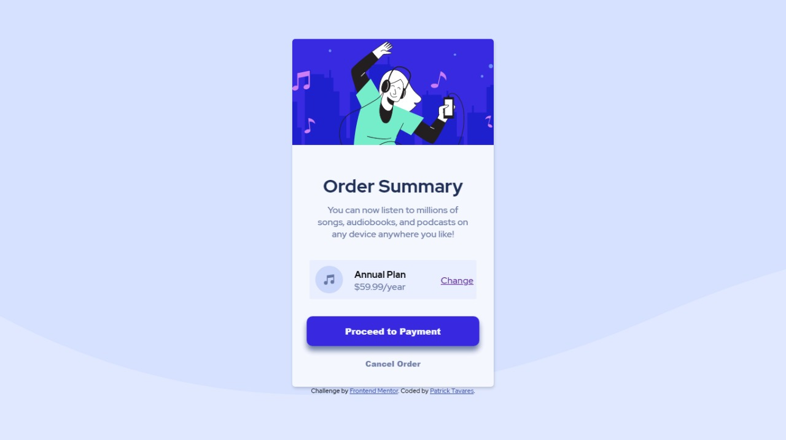
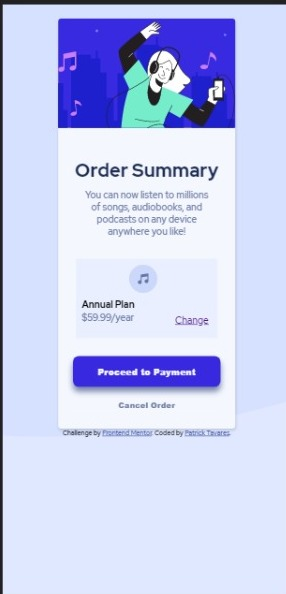

# Frontend Mentor - Order summary card solution

This is a solution to the [Order summary card challenge on Frontend Mentor](https://www.frontendmentor.io/challenges/order-summary-component-QlPmajDUj). Frontend Mentor challenges help you improve your coding skills by building realistic projects. 

### Screenshot

### Built with

- HTML 5
- CSS 3

### O que eu aprendi

Tive o conhecimento dos arquivos e tags <svg> que por sua vez não conhecia e tive que arregaçar as mangas para lidar com a mesma.  

### Desenvolvimento contínuo

Tenho como objetivo, ampliar meu conhecimento para entrer a melhor interface para o cliente.

## Autor
- Frontend Mentor - [@PatrickTav] (https://www.frontendmentor.io/profile/PatrickTav)

## Agradecimentos

Agradeço ao Alexandre, aluno na Kenzie Academy, que sempre me ajudou  e me deu forças para continuar nesse caminho.

